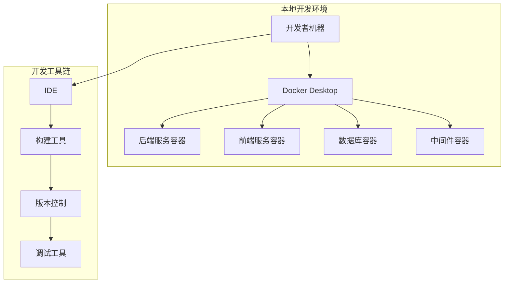

# 医院挂号系统开发环境配置指南

## 1. 开发环境概述

### 1.1 环境架构


## 2. 开发工具配置

### 2.1 必需开发工具

| 工具           | 版本  | 用途     | 下载地址                                                     |
| -------------- | ----- | -------- | ------------------------------------------------------------ |
| JDK            | 17+   | Java开发 | [Oracle JDK](https://www.oracle.com/java/technologies/javase/jdk17-archive-downloads.html) |
| Node.js        | 18+   | 前端开发 | [Node.js](https://nodejs.org/)                               |
| Docker Desktop | 4.0+  | 容器环境 | [Docker](https://www.docker.com/products/docker-desktop)     |
| Git            | 2.30+ | 版本控制 | [Git](https://git-scm.com/)                                  |
| IDE            | -     | 开发工具 | [IntelliJ IDEA](https://www.jetbrains.com/idea/) / [VS Code](https://code.visualstudio.com/) |

### 2.2 IDE配置

#### 2.2.1 IntelliJ IDEA配置（后端）
```xml
<!-- 推荐插件 -->
<plugins>
    <plugin>Spring Boot</plugin>
    <plugin>MyBatisX</plugin>
    <plugin>Lombok</plugin>
    <plugin>Maven Helper</plugin>
    <plugin>GitToolBox</plugin>
    <plugin>Rainbow Brackets</plugin>
</plugins>

<!-- 代码风格配置 -->
<code-style>
    <imports>
        <layout>*,java.**,javax.**,org.**,com.**,io.**</layout>
    </imports>
    <indent>4 spaces</indent>
    <line-length>120</line-length>
</code-style>
```

#### 2.2.2 VS Code配置（前端）
```json
{
    "recommendations": [
        "vue.volar",
        "vue.vscode-typescript-vue-plugin",
        "bradlc.vscode-tailwindcss",
        "esbenp.prettier-vscode",
        "ms-vscode.vscode-typescript-next",
        "formulahendry.auto-rename-tag"
    ],
    "settings": {
        "editor.formatOnSave": true,
        "editor.codeActionsOnSave": {
            "source.fixAll.eslint": true
        },
        "typescript.preferences.importModuleSpecifier": "relative"
    }
}
```

## 3. 本地环境搭建

### 3.1 Docker开发环境

#### 3.1.1 docker-compose.yml
```yaml
version: '3.8'

services:
  # MySQL数据库
  mysql:
    image: mysql:8.0
    container_name: hospital-mysql
    environment:
      MYSQL_ROOT_PASSWORD: root123
      MYSQL_DATABASE: hospital
      MYSQL_USER: hospital_user
      MYSQL_PASSWORD: hospital123
    ports:
      - "3306:3306"
    volumes:
      - mysql_data:/var/lib/mysql
      - ./sql/init.sql:/docker-entrypoint-initdb.d/init.sql
    command: 
      - --default-authentication-plugin=mysql_native_password
      - --character-set-server=utf8mb4
      - --collation-server=utf8mb4_unicode_ci

  # Redis缓存
  redis:
    image: redis:7-alpine
    container_name: hospital-redis
    ports:
      - "6379:6379"
    volumes:
      - redis_data:/data
    command: redis-server --appendonly yes

  # Elasticsearch
  elasticsearch:
    image: elasticsearch:8.5.0
    container_name: hospital-es
    environment:
      - discovery.type=single-node
      - xpack.security.enabled=false
      - "ES_JAVA_OPTS=-Xms512m -Xmx512m"
    ports:
      - "9200:9200"
    volumes:
      - es_data:/usr/share/elasticsearch/data

  # RabbitMQ消息队列
  rabbitmq:
    image: rabbitmq:3.11-management
    container_name: hospital-rabbitmq
    environment:
      RABBITMQ_DEFAULT_USER: admin
      RABBITMQ_DEFAULT_PASS: admin123
    ports:
      - "5672:5672"
      - "15672:15672"

volumes:
  mysql_data:
  redis_data:
  es_data:
```

### 3.2 数据库初始化脚本

#### 3.2.1 sql/init.sql
```sql
-- 创建数据库
CREATE DATABASE IF NOT EXISTS hospital DEFAULT CHARSET utf8mb4 COLLATE utf8mb4_unicode_ci;

USE hospital;

-- 患者表
CREATE TABLE patient (
    id BIGINT AUTO_INCREMENT PRIMARY KEY,
    name VARCHAR(50) NOT NULL COMMENT '姓名',
    id_card VARCHAR(18) NOT NULL UNIQUE COMMENT '身份证号',
    phone VARCHAR(11) NOT NULL COMMENT '手机号',
    gender TINYINT NOT NULL COMMENT '性别 0-女 1-男',
    birthday DATE COMMENT '出生日期',
    allergy_history TEXT COMMENT '过敏史',
    create_time DATETIME DEFAULT CURRENT_TIMESTAMP,
    update_time DATETIME DEFAULT CURRENT_TIMESTAMP ON UPDATE CURRENT_TIMESTAMP,
    INDEX idx_phone (phone),
    INDEX idx_id_card (id_card)
) COMMENT '患者表';

-- 科室表
CREATE TABLE department (
    id BIGINT AUTO_INCREMENT PRIMARY KEY,
    name VARCHAR(50) NOT NULL COMMENT '科室名称',
    code VARCHAR(20) NOT NULL UNIQUE COMMENT '科室编码',
    description TEXT COMMENT '科室描述',
    status TINYINT DEFAULT 1 COMMENT '状态 0-停用 1-启用',
    create_time DATETIME DEFAULT CURRENT_TIMESTAMP
) COMMENT '科室表';

-- 插入测试数据
INSERT INTO department (name, code, description) VALUES
('内科', 'NEIKE', '内科疾病诊疗'),
('外科', 'WAIKE', '外科手术诊疗'),
('儿科', 'ERKE', '儿童疾病诊疗'),
('妇产科', 'FUCHANKE', '妇科产科诊疗');
```

## 4. 项目结构配置

### 4.1 后端项目结构
```
hospital-backend/
├── src/
│   ├── main/
│   │   ├── java/
│   │   │   └── com/
│   │   │       └── hospital/
│   │   │           ├── HospitalApplication.java
│   │   │           ├── config/           # 配置类
│   │   │           ├── controller/       # 控制器
│   │   │           ├── service/          # 业务层
│   │   │           ├── repository/       # 数据访问层
│   │   │           ├── entity/           # 实体类
│   │   │           ├── dto/              # 数据传输对象
│   │   │           ├── util/             # 工具类
│   │   │           └── exception/        # 异常处理
│   │   └── resources/
│   │       ├── application.yml
│   │       ├── application-dev.yml
│   │       └── mapper/                   # MyBatis映射文件
│   └── test/                             # 测试代码
├── Dockerfile
├── pom.xml
└── README.md
```

### 4.2 前端项目结构
```
hospital-frontend/
├── public/
│   ├── index.html
│   └── favicon.ico
├── src/
│   ├── api/              # API接口
│   ├── assets/           # 静态资源
│   ├── components/       # 公共组件
│   ├── router/           # 路由配置
│   ├── store/            # 状态管理
│   ├── utils/            # 工具函数
│   ├── views/            # 页面组件
│   ├── App.vue
│   └── main.ts
├── package.json
├── vite.config.ts
├── tsconfig.json
└── Dockerfile
```

## 5. 开发配置

### 5.1 后端配置

#### 5.1.1 application-dev.yml
```yaml
server:
  port: 9090
  servlet:
    context-path: /api

spring:
  datasource:
    url: jdbc:mysql://localhost:3306/hospital?useUnicode=true&characterEncoding=utf8&zeroDateTimeBehavior=convertToNull&useSSL=true&serverTimezone=GMT%2B8
    username: hospital_user
    password: hospital123
    driver-class-name: com.mysql.cj.jdbc.Driver
  
  redis:
    host: localhost
    port: 6379
    database: 0
    timeout: 3000ms
    lettuce:
      pool:
        max-active: 20
        max-wait: -1ms
        max-idle: 10
        min-idle: 0
  
  elasticsearch:
    uris: http://localhost:9200
  
  rabbitmq:
    host: localhost
    port: 5672
    username: admin
    password: admin123
    virtual-host: /
  
  jackson:
    date-format: yyyy-MM-dd HH:mm:ss
    time-zone: GMT+8

mybatis-plus:
  configuration:
    map-underscore-to-camel-case: true
    log-impl: org.apache.ibatis.logging.stdout.StdOutImpl
  global-config:
    db-config:
      id-type: auto
      logic-delete-field: deleted
      logic-delete-value: 1
      logic-not-delete-value: 0

logging:
  level:
    com.hospital: debug
    org.springframework.web: info
```

### 5.2 前端配置

#### 5.2.1 vite.config.ts
```typescript
import { defineConfig } from 'vite'
import vue from '@vitejs/plugin-vue'
import { resolve } from 'path'

export default defineConfig({
  plugins: [vue()],
  resolve: {
    alias: {
      '@': resolve(__dirname, 'src')
    }
  },
  server: {
    port: 3000,
    proxy: {
      '/api': {
        target: 'http://localhost:9090',
        changeOrigin: true
      }
    }
  },
  css: {
    preprocessorOptions: {
      scss: {
        additionalData: `@import "@/styles/variables.scss";`
      }
    }
  }
})
```

#### 5.2.2 package.json 脚本配置
```json
{
  "scripts": {
    "dev": "vite",
    "build": "vue-tsc && vite build",
    "preview": "vite preview",
    "lint": "eslint . --ext .vue,.js,.jsx,.cjs,.mjs,.ts,.tsx,.cts,.mts --fix --ignore-path .gitignore",
    "format": "prettier --write src/",
    "type-check": "vue-tsc --noEmit"
  }
}
```

## 6. 开发工作流

### 6.1 Git工作流配置

#### 6.1.1 .gitignore
```
# Java
*.class
*.jar
*.war
*.ear
target/
build/

# Node.js
node_modules/
npm-debug.log*
yarn-debug.log*
yarn-error.log*

# IDE
.idea/
*.iws
*.iml
*.ipr
.vscode/

# OS
.DS_Store
Thumbs.db

# Logs
*.log
logs/

# Environment
.env
.env.local
```

#### 6.1.2 Git分支策略
```bash
# 主分支
main        # 生产代码
develop     # 开发主分支

# 功能分支
feature/    # 新功能开发
bugfix/     # 问题修复
hotfix/     # 紧急修复
```

### 6.2 代码规范配置

#### 6.2.1 后端代码规范
```xml
<!-- checkstyle.xml -->
<?xml version="1.0"?>
<!DOCTYPE module PUBLIC
          "-//Checkstyle//DTD Checkstyle Configuration 1.3//EN"
          "https://checkstyle.org/dtds/configuration_1_3.dtd">
<module name="Checker">
    <module name="TreeWalker">
        <module name="ImportControl">
            <property name="file" value="${config_loc}/import-control.xml"/>
        </module>
        <module name="IllegalImport"/>
        <module name="RedundantImport"/>
        <module name="UnusedImports"/>
    </module>
</module>
```

#### 6.2.2 前端代码规范
```javascript
// .eslintrc.js
module.exports = {
  root: true,
  env: {
    browser: true,
    es2021: true,
    node: true
  },
  extends: [
    'eslint:recommended',
    '@vue/typescript/recommended',
    'plugin:vue/vue3-essential',
    'prettier'
  ],
  parserOptions: {
    ecmaVersion: 'latest',
    sourceType: 'module'
  },
  rules: {
    'vue/multi-word-component-names': 'off',
    '@typescript-eslint/no-explicit-any': 'off'
  }
}
```

## 7. 本地启动流程

### 7.1 环境启动步骤

```bash
# 1. 启动基础设施
docker-compose up -d mysql redis elasticsearch rabbitmq

# 2. 启动后端服务
cd hospital-backend
./mvnw spring-boot:run

# 3. 启动前端服务
cd hospital-frontend
npm install
npm run dev
```

### 7.2 健康检查
访问以下地址验证服务状态：
- 后端API: http://localhost:9090/api/health
- 前端应用: http://localhost:3000
- 数据库: `mysql -h 127.0.0.1 -u hospital_user -p hospital`
- Redis: `redis-cli -h 127.0.0.1 ping`
- Elasticsearch: http://localhost:9200
- RabbitMQ管理: http://localhost:15672 (admin/admin123)

## 8. 开发调试配置

### 8.1 后端调试配置

#### 8.1.1 启动参数
```bash
java -jar -agentlib:jdwp=transport=dt_socket,server=y,suspend=n,address=5005 \
     -Dspring.profiles.active=dev \
     hospital-backend.jar
```

#### 8.1.2 远程调试配置
```json
// .vscode/launch.json
{
  "version": "0.2.0",
  "configurations": [
    {
      "type": "java",
      "name": "Debug Hospital Backend",
      "request": "attach",
      "hostName": "localhost",
      "port": 5005
    }
  ]
}
```

### 8.2 前端调试配置

#### 8.2.1 Chrome DevTools配置
```javascript
// 在浏览器控制台设置断点
// 或使用 VS Code 调试器
```

## 9. 开发环境验证清单

### 9.1 环境检查脚本
```bash
#!/bin/bash
echo "=== 开发环境检查 ==="

# 检查Java
echo "Java版本:"
java -version

# 检查Node.js
echo "Node.js版本:"
node --version

# 检查Docker
echo "Docker版本:"
docker --version

# 检查服务状态
echo "检查服务状态..."
docker ps

echo "环境检查完成"
```

这个开发环境配置提供了完整的本地开发解决方案，支持前后端分离开发、容器化部署和团队协作开发。